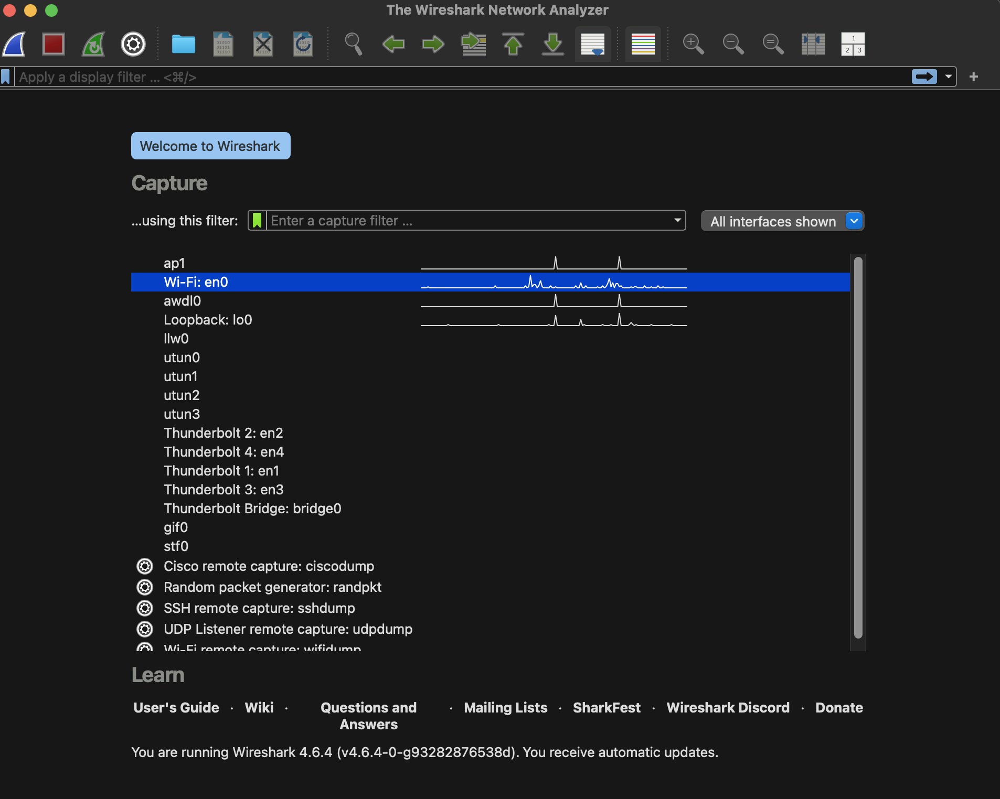
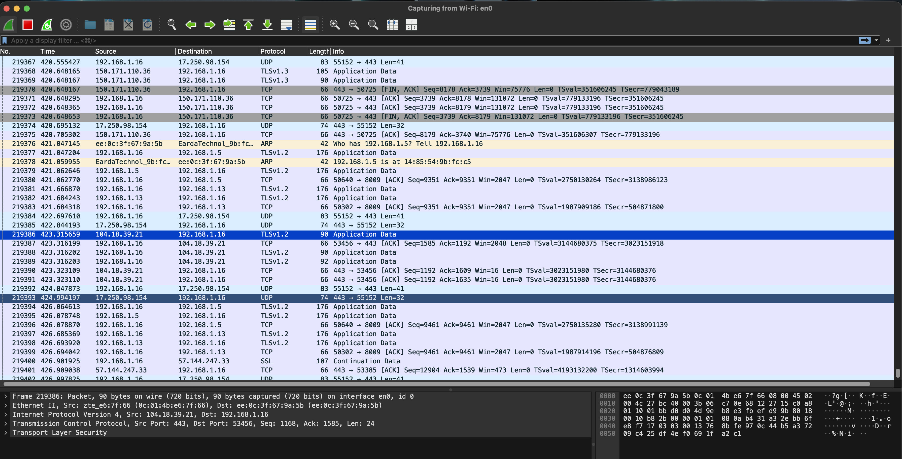
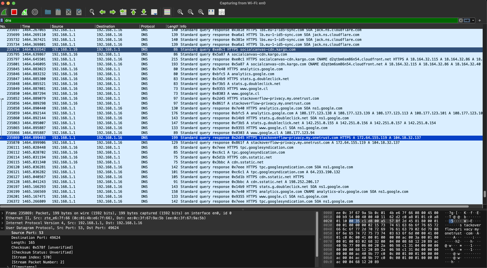
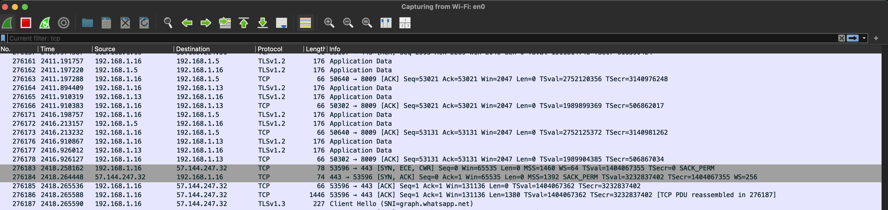
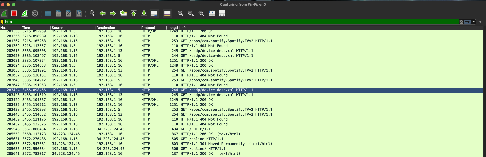
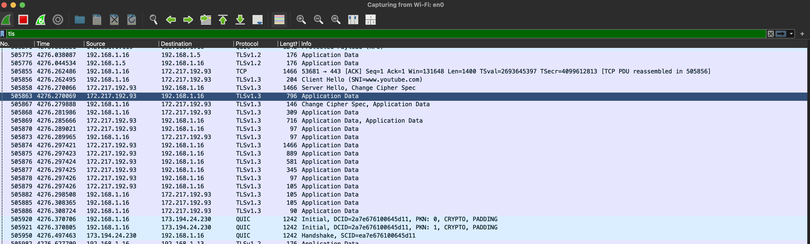

# Wireshark Introduction – Day 1

Autor: Matías Acuña  
Target Role: SOC Analyst / Cybersecurity  
Date: Monday 09 - March - 2026

---

# 1. Lab Objective

El objetivo de este laboratorio es aprender a utilizar Wireshark para capturar y analizar tráfico de red, identificar protocolos comunes y comprender cómo se comunican los dispositivos dentro de una red.

Este ejercicio forma parte de mi proceso de formación en ciberseguridad con enfoque en análisis de tráfico de red y operaciones de seguridad (SOC).

---

# 2. Lab Environment

**Operating System:**  
Mac OS Tahoe 26.3

**Tool Used:**  
Wireshark – Network Protocol Analyzer

**Network Type:**  
Red doméstica / red local

**Network Interface Used for Capture:**  
(esto lo veremos en la primera captura)

---

# 3. Packet Capture Initialization

En esta sección se documenta el proceso de inicio de captura de tráfico utilizando Wireshark.

Figura 1: Pantalla inicial de Wireshark mostrando las interfaces de red disponibles para captura de tráfico.  
Se observa la interfaz **Wi-Fi en0**, que corresponde a la conexión inalámbrica utilizada por el sistema para acceder a la red.

---

### 3.1 Network Interface Selection

Para capturar tráfico de red es necesario seleccionar la interfaz que actualmente está utilizando el equipo para conectarse a la red.

---

### 3.2 Starting the Packet Capture

Una vez identificada la interfaz de red activa, se puede iniciar la captura de paquetes haciendo doble clic sobre la interfaz seleccionada.

Wireshark comenzará inmediatamente a capturar todos los paquetes de red que pasan por esa interfaz.

---

## 4. Initial Traffic Analysis

Durante la captura de paquetes se observaron múltiples comunicaciones entre el equipo local y distintos servidores en Internet.

Entre los protocolos identificados se encuentran:

- TCP
- UDP
- TLS
- ARP

### Wireshark Traffic Capture

Figura 2: Captura de paquetes en tiempo real utilizando Wireshark.

---

### Traffic Observations

Durante el análisis del tráfico capturado se pudieron identificar distintos tipos de comunicación de red.

---

## 5. DNS Query Analysis

Para analizar las consultas DNS se aplicó el siguiente filtro en Wireshark:

dns

### DNS Query Capture

Figura 3: Captura de tráfico DNS en Wireshark utilizando el filtro `dns`.

---

### Example DNS Query Observed

IP origen: 192.168.1.16  
IP destino: 192.168.1.1  
Protocolo: DNS  

---

### Traffic Interpretation

El flujo de comunicación observado es el siguiente:

1. El equipo local solicita la dirección IP asociada a un dominio.
2. El servidor DNS responde con la dirección IP correspondiente.
3. Una vez obtenida la IP, el cliente puede establecer una conexión con el servidor.

---

## Notes

En análisis de seguridad, DNS se usa para detectar:

* malware comunicándose con servidores externos
* dominios sospechosos
* DNS tunneling
* beaconing de malware
* comunicación con C2

---

## 6. TCP Connection Establishment Analysis

Para observar el establecimiento de conexiones TCP se aplicó el siguiente filtro en Wireshark:

tcp

### TCP Three-Way Handshake Capture

Figura 4: Proceso de establecimiento de conexión TCP observado en Wireshark.

---

### Three-Way Handshake

El protocolo TCP utiliza un mecanismo conocido como **Three-Way Handshake** para establecer una conexión confiable entre dos dispositivos.

---

## Notes

En análisis SOC el handshake TCP permite detectar:

* Escaneos de puertos
* conexiones sospechosas
* malware intentando conectarse
* ataques de fuerza bruta

---

## 7. HTTP Traffic Analysis

Para analizar tráfico web sin cifrado se accedió al sitio:

http://neverssl.com

### HTTP Traffic Capture

Figura 5: Captura de tráfico HTTP en Wireshark utilizando el filtro `http`.

---

### Traffic Observation

El protocolo HTTP transmite información **sin cifrado**, por lo que el contenido de las solicitudes puede ser visualizado directamente en Wireshark.

---

## 8. HTTPS Traffic Analysis

Para observar tráfico web cifrado se accedió al sitio:

https://github.com

### HTTPS Traffic Capture

Figura 6: Captura de tráfico HTTPS en Wireshark utilizando TLS.

---

### Traffic Observation

A diferencia del protocolo HTTP, HTTPS utiliza cifrado mediante TLS (Transport Layer Security) para proteger la comunicación entre el cliente y el servidor.

En la captura se pueden observar mensajes del protocolo TLS como:

* Client Hello  
* Server Hello  
* Application Data

El mensaje **Client Hello** inicia el proceso de negociación TLS, donde el cliente propone los algoritmos de cifrado que puede utilizar.

El servidor responde con **Server Hello**, seleccionando los parámetros de cifrado que se utilizarán durante la sesión.

Una vez finalizado este proceso, los datos transmitidos aparecen como **Application Data**, lo que significa que el contenido de la comunicación está cifrado y no puede ser visualizado directamente en Wireshark.